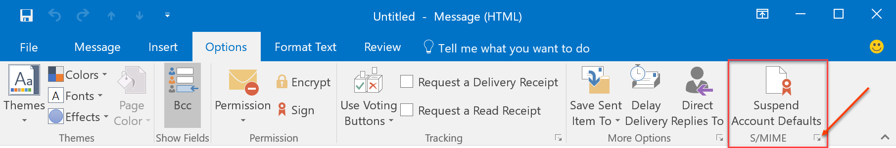
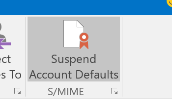
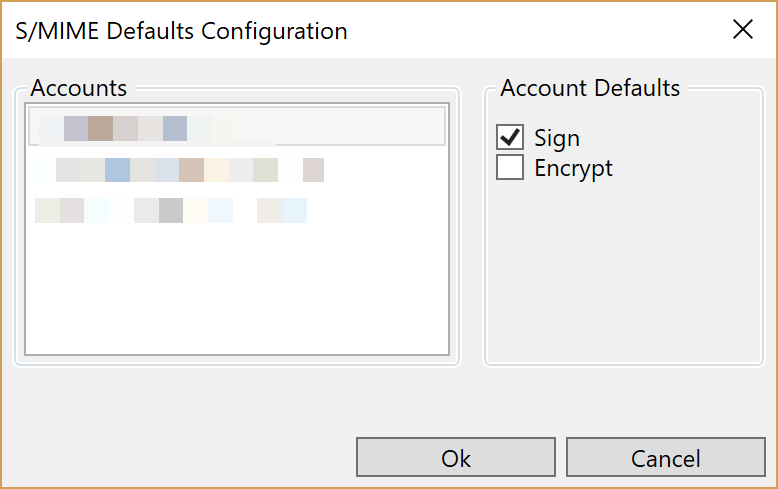

# SmimeAccountDefaults
Enable per-account configuration of Outlook S/MIME signing and encryption defaults

This is an Outlook add-in to enable per-account default settings for message signing and encryption. Helpful if you have multiple
accounts in Outlook and only want to sign/encrypt from select ones by default.

# Installation
A ClickOnce/VSTO setup program is here:
https://novotnyorgstorage.blob.core.windows.net/smimeaccountdefaults/setup.exe

Run that and follow the prompts to install the AddIn. The AddIn will check for updates daily.

# Configuration
The addin won't do anything by default without configuration. You must first configure Outlook
to use your Digital Certificate following the instructions [here](https://support.office.com/en-us/article/get-a-digital-id-0eaa0ab9-b8a2-4a7e-828b-9bded6370b7b#ID0EAABAAA=2016,_2013,_2010) where it says
"Specify Digital ID to use". You may have more than one if you have multiple accounts. If so, create a new "Security Settings Preference" for each. In the "Encrypted e-mail" settings shown there, do not enable
"Encrypt contents.... " or "Add digital signature to outgoing messagers." 

Those settings apply to **all** accounts you have in Outlook and will
generate an error if you do not have a digital signature preference configured for all accounts. You also may not
want to sign or encrypt messages for all accounts by default. 

Next, create a new email message and go to the Options Tab:

There are two options:

1. Clicking the icon itself will suspend its behavior of signing/encrypting messages until your re-enable it. Useful if you want to send some messages without your configuration applied. You can still use per-message settings the normal way. Here's what it looks like suspended: 
2. Clicking the dialog launcher in the lower-right corner (see arrow) to bring up the configuration window. This is how you specify what settings should apply per account. Select the account and then either or both `Sign` / `Encrypt`. Hit `Ok` to save the changes.

That's it, now just send an email. On send, it will apply the specified message settings, `Sign`, `Encrypt`, or both depending on which account you're sending from.

# Issues
Please file issues on GitHub here in this repo. You can also reach me on twitter [@onovotny](https://twitter.com/onovotny).